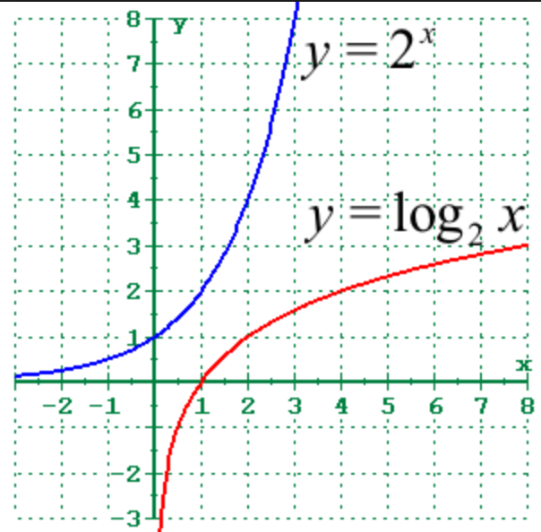
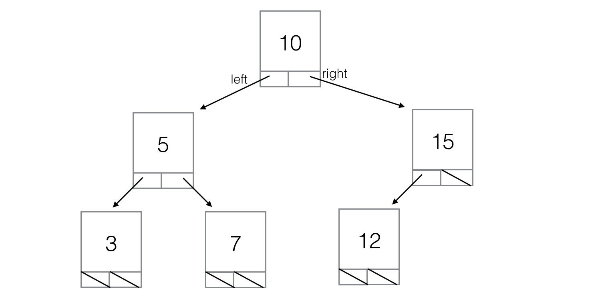

# Binary Search Trees
A mini-course in binary search trees in JS for novice programmers.

A binary search tree (BST) is an efficient recursive data structure.

## Prerequisites

Mastery of [singly linked lists](https://github.com/mikegagnon/linked-lists/blob/master/README.md) and
[doubly linked lists](https://github.com/mikegagnon/dlists/blob/master/README.md)

## Contents

- [Lecture 1. Summary of algorithmic performance](#lec1)
- [Lecture 2. *O(log(N))*](#lec2)
- [Lecture 3. `BNode`](#lec3)
- [Lecture 4. `isValid()`](#lec4)
- [Lecture 5. `insert(...)`](#lec5)

## <a name="lec1">Lecture 1. Summary of algorithmic performance</a>

| Function      | Singly linked list | Doubly linked List | Binary Search Tree |
| ------------- |--------------------|--------------------|--------------------|
| `insert`      | n/a                | n/a                | *O(log(N))*        |
| `append`      | *O(N)*             | *O(1)*             | n/a                |
| `prepend`     | *O(1)*             | *O(1)*             | n/a                |
| `removeFirst` | *O(1)*             | *O(1)*             | n/a                |
| `removeLast`  | *O(N)*             | *O(1)*             | n/a                |
| `removeValue` | *O(N)*             | *O(N)*             | *O(log(N))*        |
| `findSmallest`| *O(N)*             | *O(N)*             | *O(log(N))*        |
| `sort`        | *O(N^2)*           | *O(N^2)*           | *O(N)*             |

## <a name="lec2">Lecture 2. *O(log(N))*</a>

The exponential function grows exorbitantly fast.

The logarithmic function grows exorbitantly slow.



### Defining log(N)

Say you have a single-elmination tournament with 16 players. How many rounds does it take to determine the victor?

The tournament starts with 16 players, then:

- (Round 1) half get eliminated leaving 8, then
- (Round 2) half get eliminated leaving 4, then
- (Round 3) half get eliminated leaving 2, then
- (Round 4) half get eliminated leaving 1, the victor

It only takes four rounds to handle 16 players.

And only five rounds to handle 32 players.

And only six rounds to handle 64 players.

And only seven rounds to handle 128 players.

...

In general:

- *N* is the number of players
- *Y* is the number of rounds it takes to find the victor
- *Y = log(N)*

When *N* is a very large number, *log(N)* is a relatively small number.

For example:

- *log(1) == 0*
- *log(2) == 1*
- *log(4) == 2*
- *log(8) == 3*
- *log(16) == 4*
- *log(32) == 5*
- *log(64) == 6*
- ...
- *log(4,294,967,296) == 32*

As *N* grows exponentially, *log(N)* grows linearly.

Therefore *O(log(N))* is considered very efficient, almost as good as *O(1)*.

## <a name="lec3">`BNode`</a>

Like linked lists, binary search trees are composed of nodes.

Here's the basic class definition for a `BNode` -- the node structure for BSTs:

```js
class BNode {
    constructor(key) {
        this.key = key;
        this.left = undefined;
        this.right = undefined;
    }
}
```

`BNode`s link together to form "trees," like so:



### The BST invariant

For every `BNode` in a tree, say `node`:

- Every key in `node`'s left subtree must be **less than** `node.key`
- Every key in `node`'s right subtree must be **greater than** `node.key`

Observe how this property holds in the diagram above.

## <a name="lec4">`isValid()`</a>

Let's write a function, `isValid()` that tests to see if `BNode` is a valid BST.

```js
class BNode {

    ...

    // Returns true iff this node represents the root of a valid BST.
    // 
    // A tree of nodes is valid iff:
    //      - Every key in node's left subtree is less than node.key
    //      - Every key in node's right subtree is greater than node.key
    isValid() {
        var leftValid;
        var rightValid;

        if (this.left == undefined) {
            leftValid = true;
        } else {
            leftValid = this.left.isValid() && this.left.max() < this.key;
        }

        if (this.right == undefined) {
            rightValid = true;
        } else {
            rightValid = this.right.isValid() && this.right.min() > this.key;
        }

        return leftValid && rightValid;
    }

    max() {
        if (this.right == undefined) {
            return this.key;
        } else {
            return this.right.max();
        }
    }

    min() {
        if (this.left == undefined) {
            return this.key;
        } else {
            return this.left.min();
        }
    }
}
```

### Breaking down the code

#### Definition of validity

A tree of nodes is valid iff:

- Every `key` in `node`'s left subtree is less than `node.key`
- Every `key` in `node`'s right subtree is greater than `node.key`

#### Left side validity

We will only analyze the left recursive case, since the right recursive
case is simply the mirror of the left.

```js
if (this.left == undefined) {
    leftValid = true;
} else {
    leftValid = this.left.isValid() && this.left.max() < this.key;
}
```

##### Base case

If there is no left node, then the left side is clearly valid;

##### Recursive case

```js
leftValid = this.left.isValid() && this.left.max() < this.key;
```

We assume that `this.left.isValid()` is correct; i.e.,
it returns true iff `this.left` is a valid BST.

But just because `this.left` is a valid BST, does not
mean that the left case is valid. Consider an example:

```
             10
     5               15
   3   *11*       12    20
```

Here `root.left` is a valid BST (3, 5, 11).

However, 11 is greater than 10, therefore the total tree is is an invalid BST.

We must check to see if every `key` in `node`'s left subtree is less than `node.key`.

If `this.left.isValid()`, then we know the right-most node in `this.left`'s tree
is the maximum value of `this.left`'s tree.

Therefore, we know every `key` in `node`'s left subtree is less than `node.key`
iff `this.left.max() < this.key`.

This observation yields our final recursive case:

```js
leftValid = this.left.isValid() && this.left.max() < this.key;
```

### Tests for min(), max(), and isValid()

```js
// BST with one node
var key = 10
var node = new BNode(key);
assert(node.min() == key);
assert(node.max() == key);
assert(node.isValid());

// Valid BST with one left node
var node = new BNode(10);
node.left = new BNode(5);
assert(node.left.min() == 5);
assert(node.left.max() == 5);
assert(node.isValid());

// Valid BST with one right node
var node = new BNode(10);
node.right = new BNode(15);
assert(node.right.min() == 15);
assert(node.right.max() == 15);
assert(node.isValid());

// Invalid BST with one left node
var node = new BNode(10);
node.left = new BNode(15);
assert(node.left.min() == 15);
assert(node.left.max() == 15);
assert(!node.isValid());

// Invalid BST with one right node
var node = new BNode(10);
node.right = new BNode(5);
assert(node.right.min() == 5);
assert(node.right.max() == 5);
assert(!node.isValid());

// Valid BST with one left node and one right node
var node = new BNode(10);
node.left = new BNode(5);
assert(node.left.min() == 5);
assert(node.left.max() == 5);
node.right = new BNode(15);
assert(node.right.min() == 15);
assert(node.right.max() == 15);
assert(node.isValid());

// Invalid BST with one left node and one right node: left node invalid
var node = new BNode(10);
node.left = new BNode(15);
assert(node.left.min() == 15);
assert(node.left.max() == 15);
node.right = new BNode(15);
assert(node.right.min() == 15);
assert(node.right.max() == 15);
assert(!node.isValid());

// Invalid BST with one left node and one right node: right node invalid
var node = new BNode(10);
node.left = new BNode(5);
assert(node.left.min() == 5);
assert(node.left.max() == 5);
node.right = new BNode(5);
assert(node.right.min() == 5);
assert(node.right.max() == 5);
assert(!node.isValid());

// Valid BST:
//
//             10
//     5               15
//   3   7          12    20
// 
var node = new BNode(10);
node.left = new BNode(5);
node.left.left = new BNode(3);
node.left.right = new BNode(7);
node.right = new BNode(15);
node.right.right = new BNode(20);
node.right.left = new BNode(12);

assert(node.left.min() == 3);
assert(node.left.max() == 7);
assert(node.right.min() == 12);
assert(node.right.max() == 20);
assert(node.isValid());

// Invalid BST:
//
//             10
//     5               15
// *6*   7       12    20
// 
var node = new BNode(10);
node.left = new BNode(5);
node.left.left = new BNode(6);
node.left.right = new BNode(7);
node.right = new BNode(15);
node.right.right = new BNode(20);
node.right.left = new BNode(12);

assert(node.left.min() == 6);
assert(node.left.max() == 7);
assert(node.right.min() == 12);
assert(node.right.max() == 20);
assert(!node.isValid());

// Invalid BST:
//
//             10
//     5               15
//   3   *11*       12    20
// 
var node = new BNode(10);
node.left = new BNode(5);
node.left.left = new BNode(3);
node.left.right = new BNode(11);
node.right = new BNode(15);
node.right.right = new BNode(20);
node.right.left = new BNode(12);

assert(node.left.min() == 3);
assert(node.left.max() == 11);
assert(node.right.min() == 12);
assert(node.right.max() == 20);
assert(!node.isValid());

// Invalid BST:
//
//             10
//     5               15
//   3   7         *8*    20
// 
var node = new BNode(10);
node.left = new BNode(5);
node.left.left = new BNode(3);
node.left.right = new BNode(7);
node.right = new BNode(15);
node.right.right = new BNode(20);
node.right.left = new BNode(8);

assert(node.left.min() == 3);
assert(node.left.max() == 7);
assert(node.right.min() == 8);
assert(node.right.max() == 20);
assert(!node.isValid());

// Invalid BST:
//
//             10
//     5               15
//   3   7          12    *14*
// 
var node = new BNode(10);
node.left = new BNode(5);
node.left.left = new BNode(3);
node.left.right = new BNode(7);
node.right = new BNode(15);
node.right.right = new BNode(14);
node.right.left = new BNode(12);

assert(node.left.min() == 3);
assert(node.left.max() == 7);
assert(node.right.min() == 12);
assert(node.right.max() == 14);
assert(!node.isValid());
```

## <a name="lec5">insert(...)</a>

Study the `insert(...)` method:

```js
class BNode {

    ...
    
    // Assumg this is a valid BST, insert(key) creates a new BNode for key,
    // and inserts it into the BST. The insertion is performed in a way such
    // that this remains a valid BST
    insert(key) {
        if (key < this.key) {
            if (this.left == undefined) {
                this.left = new BNode(key);
            } else {
                this.left.insert(key);
            }
        } else if (key > this.key) {
            if (this.right == undefined) {
                this.right = new BNode(key);
            } else {
                this.right.insert(key);
            }
        } else {
            console.error("Key is already in the BST")
        }
    }
}
```

### Algorithmic complexity

On average, `insert(...)` has *O(log(N))* performance.

Imagine a perfectly balanced BST with *N* nodes

#### If *N* == 1
Then the BST has a depth of 1

#### If *N* == 3
  x
x   x

Then the BST has a depth of 2

#### If *N* == 7
      x
  x       x
 x x     x x
 
Then the BST has a depth of 3

#### If *N* == 15
            x
     x             x
 x       x      x      x
x x     x x    x x    x x
 
Then the BST has a depth of 4

#### If *N* == 31
                x
          x                 x
     x         x        x        x
   x   x     x   x    x   x    x   x
  x x x x   x x x x  x x x x  x x x x
  
Then the BST has a depth of 5

#### In general...

When you increase the depth by one, *N* apporoximately doubles.

Therefore: *N* ≈ 2<sup>depth</sup> and *log(N)* ≈ depth.


